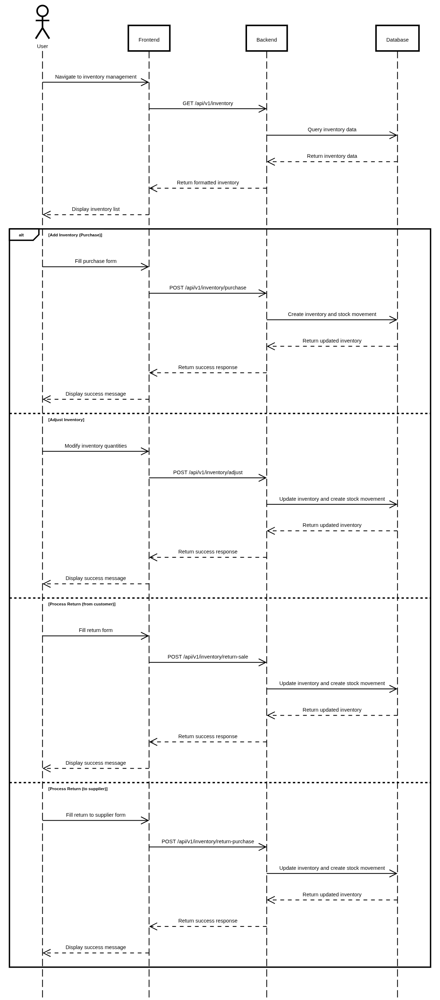

# Inventory Management

## User Flow

1. User navigates to inventory management section
2. System displays current inventory status for products
3. User can:
   - Add new inventory (purchase)
   - Adjust inventory quantities
   - View inventory history
   - Process returns from customers
   - Process returns to suppliers

```mermaid
sequenceDiagram
    actor User
    participant Frontend
    participant Backend
    participant Database

    User->>Frontend: Navigate to inventory management
    Frontend->>Backend: GET /api/v1/inventory
    Backend->>Database: Query inventory data
    Database-->>Backend: Return inventory data
    Backend-->>Frontend: Return formatted inventory
    Frontend-->>User: Display inventory list
    
    alt Add Inventory (Purchase)
        User->>Frontend: Fill purchase form
        Frontend->>Backend: POST /api/v1/inventory/purchase
        Backend->>Database: Create inventory and stock movement
        Database-->>Backend: Return updated inventory
        Backend-->>Frontend: Return success response
        Frontend-->>User: Display success message
    else Adjust Inventory
        User->>Frontend: Modify inventory quantities
        Frontend->>Backend: POST /api/v1/inventory/adjust
        Backend->>Database: Update inventory and create stock movement
        Database-->>Backend: Return updated inventory
        Backend-->>Frontend: Return success response
        Frontend-->>User: Display success message
    else Process Return (from customer)
        User->>Frontend: Fill return form
        Frontend->>Backend: POST /api/v1/inventory/return-sale
        Backend->>Database: Update inventory and create stock movement
        Database-->>Backend: Return updated inventory
        Backend-->>Frontend: Return success response
        Frontend-->>User: Display success message
    else Process Return (to supplier)
        User->>Frontend: Fill return to supplier form
        Frontend->>Backend: POST /api/v1/inventory/return-purchase
        Backend->>Database: Update inventory and create stock movement
        Database-->>Backend: Return updated inventory
        Backend-->>Frontend: Return success response
        Frontend-->>User: Display success message
    end
```



## Database Operations

### Add Inventory (Purchase)

```typescript
// Add inventory through purchase
const addInventoryPurchase = async (
  productId: string,
  data: {
    quantity: number;
    cost: number;
  }
) => {
  // Use transaction to ensure data consistency
  return await prisma.$transaction(async (tx) => {
    // Create inventory record
    const inventory = await tx.inventory.create({
      data: {
        product_id: productId,
        quantity: data.quantity,
        total: data.quantity * data.cost
      }
    });
    
    // Create stock movement record
    const stockMovement = await tx.stock_movement.create({
      data: {
        product_id: productId,
        quantity: data.quantity,
        type: 'PURCHASE'
      }
    });
    
    // Update product cost if needed
    await tx.product.update({
      where: { id: productId },
      data: {
        cost: data.cost
      }
    });
    
    return { inventory, stockMovement };
  });
};
```

### Adjust Inventory

```typescript
// Adjust inventory quantity
const adjustInventory = async (
  productId: string,
  data: {
    quantity: number; // Can be positive or negative
    reason: string;
  }
) => {
  // Use transaction to ensure data consistency
  return await prisma.$transaction(async (tx) => {
    // Get current inventory
    const currentInventory = await tx.inventory.findFirst({
      where: {
        product_id: productId,
        status: 'ACTIVE'
      }
    });
    
    const newQuantity = currentInventory 
      ? currentInventory.quantity + data.quantity 
      : data.quantity;
    
    // Update or create inventory
    const inventory = currentInventory 
      ? await tx.inventory.update({
          where: { id: currentInventory.id },
          data: { quantity: newQuantity }
        })
      : await tx.inventory.create({
          data: {
            product_id: productId,
            quantity: data.quantity
          }
        });
    
    // Create stock movement record
    const stockMovement = await tx.stock_movement.create({
      data: {
        product_id: productId,
        quantity: data.quantity,
        type: 'ADJUSTMENT'
      }
    });
    
    return { inventory, stockMovement };
  });
};
```

### Process Return from Customer

```typescript
// Process return from customer
const processReturnSale = async (
  productId: string,
  data: {
    quantity: number;
    orderId?: string;
  }
) => {
  // Use transaction to ensure data consistency
  return await prisma.$transaction(async (tx) => {
    // Get current inventory
    const currentInventory = await tx.inventory.findFirst({
      where: {
        product_id: productId,
        status: 'ACTIVE'
      }
    });
    
    const newQuantity = currentInventory 
      ? currentInventory.quantity + data.quantity 
      : data.quantity;
    
    // Update or create inventory
    const inventory = currentInventory 
      ? await tx.inventory.update({
          where: { id: currentInventory.id },
          data: { quantity: newQuantity }
        })
      : await tx.inventory.create({
          data: {
            product_id: productId,
            quantity: data.quantity
          }
        });
    
    // Create stock movement record
    const stockMovement = await tx.stock_movement.create({
      data: {
        product_id: productId,
        quantity: data.quantity,
        type: 'RETURN_SALE'
      }
    });
    
    // Update order status if provided
    if (data.orderId) {
      await tx.order.update({
        where: { id: data.orderId },
        data: { status: 'RETURNED' }
      });
    }
    
    return { inventory, stockMovement };
  });
};
```

### Process Return to Supplier

```typescript
// Process return to supplier
const processReturnPurchase = async (
  productId: string,
  data: {
    quantity: number;
  }
) => {
  // Use transaction to ensure data consistency
  return await prisma.$transaction(async (tx) => {
    // Get current inventory
    const currentInventory = await tx.inventory.findFirst({
      where: {
        product_id: productId,
        status: 'ACTIVE'
      }
    });
    
    if (!currentInventory || currentInventory.quantity < data.quantity) {
      throw new Error('Insufficient inventory for return');
    }
    
    // Update inventory
    const inventory = await tx.inventory.update({
      where: { id: currentInventory.id },
      data: { quantity: currentInventory.quantity - data.quantity }
    });
    
    // Create stock movement record
    const stockMovement = await tx.stock_movement.create({
      data: {
        product_id: productId,
        quantity: -data.quantity, // Negative quantity for outgoing stock
        type: 'RETURN_PURCHASE'
      }
    });
    
    return { inventory, stockMovement };
  });
};
```

### Get Inventory History

```typescript
// Get inventory history for a product
const getInventoryHistory = async (
  productId: string,
  pagination: {
    page: number;
    limit: number;
  }
) => {
  const { page, limit } = pagination;
  const skip = (page - 1) * limit;
  
  // Get stock movements
  const [movements, total] = await Promise.all([
    prisma.stock_movement.findMany({
      where: {
        product_id: productId
      },
      skip,
      take: limit,
      orderBy: {
        createdAt: 'desc'
      }
    }),
    prisma.stock_movement.count({
      where: {
        product_id: productId
      }
    })
  ]);
  
  return {
    movements,
    pagination: {
      page,
      limit,
      total,
      totalPages: Math.ceil(total / limit)
    }
  };
};
```
