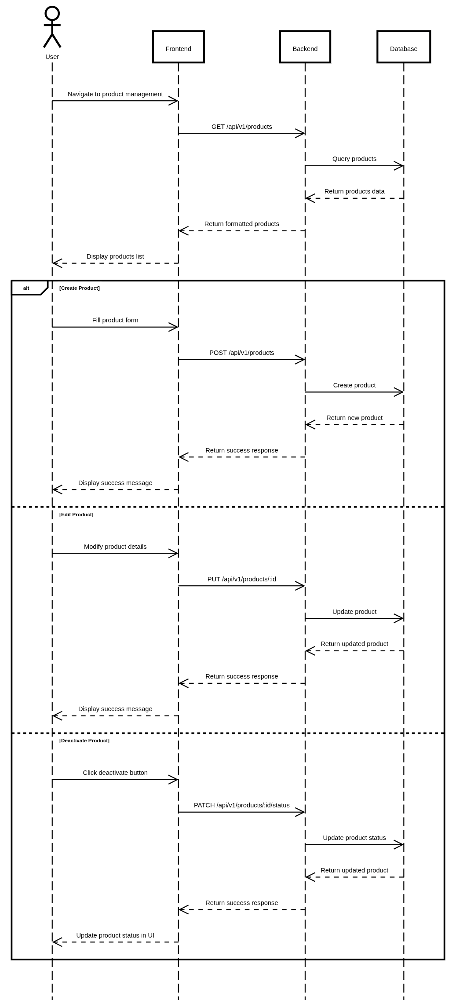

# Product Management

## User Flow

1. User navigates to product management section
2. System displays list of products for the selected store
3. User can:
   - Create new products
   - Edit existing products
   - Deactivate/activate products
   - Assign products to categories
   - Add tags to products

```mermaid
sequenceDiagram
    actor User
    participant Frontend
    participant Backend
    participant Database

    User->>Frontend: Navigate to product management
    Frontend->>Backend: GET /api/v1/products
    Backend->>Database: Query products
    Database-->>Backend: Return products data
    Backend-->>Frontend: Return formatted products
    Frontend-->>User: Display products list
    
    alt Create Product
        User->>Frontend: Fill product form
        Frontend->>Backend: POST /api/v1/products
        Backend->>Database: Create product
        Database-->>Backend: Return new product
        Backend-->>Frontend: Return success response
        Frontend-->>User: Display success message
    else Edit Product
        User->>Frontend: Modify product details
        Frontend->>Backend: PUT /api/v1/products/:id
        Backend->>Database: Update product
        Database-->>Backend: Return updated product
        Backend-->>Frontend: Return success response
        Frontend-->>User: Display success message
    else Deactivate Product
        User->>Frontend: Click deactivate button
        Frontend->>Backend: PATCH /api/v1/products/:id/status
        Backend->>Database: Update product status
        Database-->>Backend: Return updated product
        Backend-->>Frontend: Return success response
        Frontend-->>User: Update product status in UI
    end
```



## Database Operations

### Create Product

```typescript
// Create a new product
const createProduct = async (
  storeId: string,
  userId: string,
  productData: {
    name: string;
    sku: string;
    barcode?: string;
    price: number;
    cost: number;
    image_url?: string;
    description?: string;
    categoryIds?: string[];
    tagIds?: string[];
  }
) => {
  const { name, sku, barcode, price, cost, image_url, description, categoryIds = [], tagIds = [] } = productData;
  
  return await prisma.product.create({
    data: {
      store_id: storeId,
      name,
      sku,
      barcode,
      price,
      cost,
      image_url,
      description,
      created_by: userId,
      categories: {
        connect: categoryIds.map(id => ({ id }))
      },
      tags: {
        connect: tagIds.map(id => ({ id }))
      }
    },
    include: {
      categories: true,
      tags: true
    }
  });
};
```

### Update Product

```typescript
// Update an existing product
const updateProduct = async (
  productId: string,
  productData: {
    name?: string;
    sku?: string;
    barcode?: string;
    price?: number;
    cost?: number;
    image_url?: string;
    description?: string;
    categoryIds?: string[];
    tagIds?: string[];
  }
) => {
  const { name, sku, barcode, price, cost, image_url, description, categoryIds, tagIds } = productData;
  
  // Prepare update data
  const updateData: any = {};
  if (name !== undefined) updateData.name = name;
  if (sku !== undefined) updateData.sku = sku;
  if (barcode !== undefined) updateData.barcode = barcode;
  if (price !== undefined) updateData.price = price;
  if (cost !== undefined) updateData.cost = cost;
  if (image_url !== undefined) updateData.image_url = image_url;
  if (description !== undefined) updateData.description = description;
  
  // Handle category and tag relationships
  const relations: any = {};
  if (categoryIds) {
    // First disconnect all categories, then connect the new ones
    relations.categories = {
      set: [],
      connect: categoryIds.map(id => ({ id }))
    };
  }
  
  if (tagIds) {
    // First disconnect all tags, then connect the new ones
    relations.tags = {
      set: [],
      connect: tagIds.map(id => ({ id }))
    };
  }
  
  return await prisma.product.update({
    where: { id: productId },
    data: {
      ...updateData,
      ...relations
    },
    include: {
      categories: true,
      tags: true
    }
  });
};
```

### Change Product Status

```typescript
// Activate or deactivate a product
const updateProductStatus = async (productId: string, status: 'ACTIVE' | 'INACTIVE') => {
  return await prisma.product.update({
    where: { id: productId },
    data: {
      product_status: status
    }
  });
};
```

### Get Products

```typescript
// Get products with filtering and pagination
const getProducts = async (
  storeId: string,
  filters: {
    status?: 'ACTIVE' | 'INACTIVE';
    categoryId?: string;
    tagId?: string;
    search?: string;
  },
  pagination: {
    page: number;
    limit: number;
  }
) => {
  const { status, categoryId, tagId, search } = filters;
  const { page, limit } = pagination;
  const skip = (page - 1) * limit;
  
  // Build where condition
  const where: any = {
    store_id: storeId
  };
  
  if (status) {
    where.product_status = status;
  }
  
  if (categoryId) {
    where.categories = {
      some: {
        id: categoryId
      }
    };
  }
  
  if (tagId) {
    where.tags = {
      some: {
        id: tagId
      }
    };
  }
  
  if (search) {
    where.OR = [
      { name: { contains: search, mode: 'insensitive' } },
      { sku: { contains: search, mode: 'insensitive' } },
      { barcode: { contains: search, mode: 'insensitive' } }
    ];
  }
  
  // Get products
  const [products, total] = await Promise.all([
    prisma.product.findMany({
      where,
      skip,
      take: limit,
      include: {
        categories: true,
        tags: true,
        inventories: {
          where: {
            status: 'ACTIVE'
          }
        }
      },
      orderBy: {
        createdAt: 'desc'
      }
    }),
    prisma.product.count({ where })
  ]);
  
  return {
    products,
    pagination: {
      page,
      limit,
      total,
      totalPages: Math.ceil(total / limit)
    }
  };
};
```
