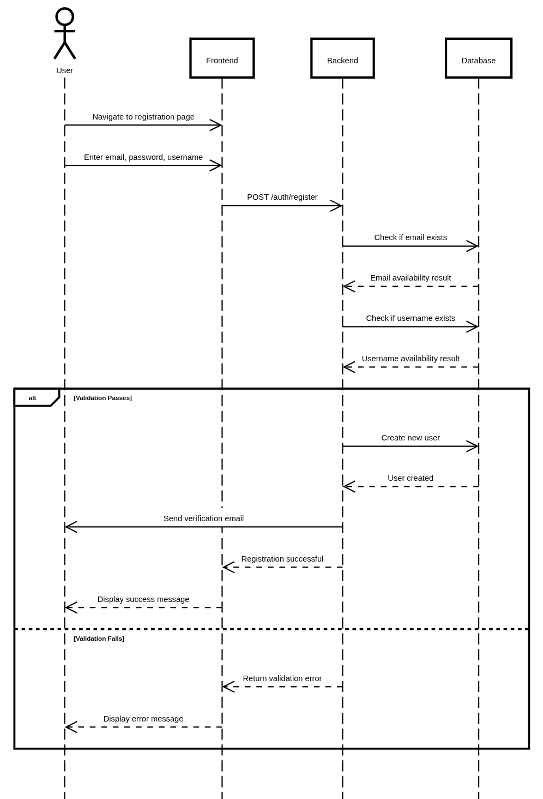

# User Registration

## User Flow

1. User navigates to registration page
2. User enters email, password, and username
3. System validates input:
   - Email must be unique
   - Username must be unique
   - Password must meet security requirements
4. If validation passes, system creates a new user account with default role "USER"
5. System sends verification email to user (optional)
6. User receives confirmation of successful registration

```mermaid
sequenceDiagram
    actor User
    participant Frontend
    participant Backend
    participant Database

    User->>Frontend: Navigate to registration page
    User->>Frontend: Enter email, password, username
    Frontend->>Backend: POST /api/v1/auth/register
    Backend->>Database: Check if email exists
    Database-->>Backend: Email availability result
    Backend->>Database: Check if username exists
    Database-->>Backend: Username availability result
    
    alt Validation Passes
        Backend->>Database: Create new user
        Database-->>Backend: User created
        Backend->>User: Send verification email
        Backend-->>Frontend: Registration successful
        Frontend-->>User: Display success message
    else Validation Fails
        Backend-->>Frontend: Return validation error
        Frontend-->>User: Display error message
    end
```



## Database Operations

### Create User

```typescript
// Create a new user in the database
const createUser = async (email: string, password: string, username: string) => {
  const hashedPassword = await bcrypt.hash(password, 10);
  
  return await prisma.user.create({
    data: {
      email,
      password: hashedPassword,
      username,
      role: 'USER',
      status: 'ACTIVE',
      is_verified: false
    }
  });
};
```

### Check Email Availability

```typescript
// Check if email is already in use
const isEmailAvailable = async (email: string) => {
  const existingUser = await prisma.user.findUnique({
    where: {
      email
    }
  });
  
  return !existingUser;
};
```
