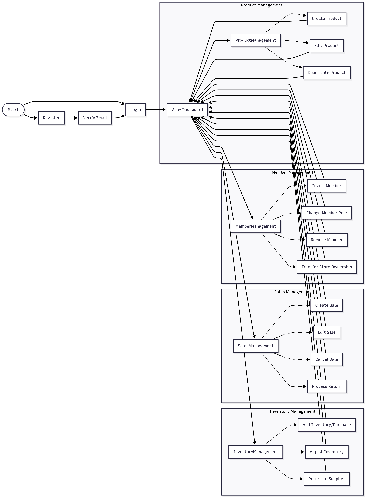

# POS System User Flow

This document provides an overview of the user flow in the POS system and links to detailed use cases.

## Main User Flow Diagram

```mermaid
flowchart LR
    Start([Start]) --> Register[Register]
    Start --> Login[Login]
    Register --> VerifyEmail[Verify Email]
    VerifyEmail --> Login
    Login --> Dashboard[View Dashboard]

    subgraph PRODUCT [Product Management]
        CreateProduct[Create Product]
        EditProduct[Edit Product]
        DeactivateProduct[Deactivate Product]
        ProductManagement -.-> CreateProduct
        ProductManagement -.-> EditProduct
        ProductManagement -.-> DeactivateProduct
        CreateProduct --> Dashboard
        EditProduct   --> Dashboard
        DeactivateProduct --> Dashboard
    end

    subgraph INVENTORY [Inventory Management]
        AddInventory[Add Inventory/Purchase]
        AdjustInventory[Adjust Inventory]
        ReturnToSupplier[Return to Supplier]
        InventoryManagement -.-> AddInventory
        InventoryManagement -.-> AdjustInventory
        InventoryManagement -.-> ReturnToSupplier
        AddInventory --> Dashboard
        AdjustInventory --> Dashboard
        ReturnToSupplier --> Dashboard
    end

    subgraph SALES [Sales Management]
        CreateSale[Create Sale]
        EditSale[Edit Sale]
        CancelSale[Cancel Sale]
        ProcessReturn[Process Return]
        SalesManagement -.-> CreateSale
        SalesManagement -.-> EditSale
        SalesManagement -.-> CancelSale
        SalesManagement -.-> ProcessReturn
        CreateSale --> Dashboard
        EditSale   --> Dashboard
        CancelSale --> Dashboard
        ProcessReturn --> Dashboard
    end

    subgraph MEMBER [Member Management]
        InviteMember[Invite Member]
        ChangeRole[Change Member Role]
        RemoveMember[Remove Member]
        TransferOwnership[Transfer Store Ownership]
        MemberManagement -.-> InviteMember
        MemberManagement -.-> ChangeRole
        MemberManagement -.-> RemoveMember
        MemberManagement -.-> TransferOwnership
        InviteMember --> Dashboard
        ChangeRole --> Dashboard
        RemoveMember --> Dashboard
        TransferOwnership --> Dashboard
    end

    Dashboard --> ProductManagement
    Dashboard --> InventoryManagement
    Dashboard --> SalesManagement
    Dashboard --> MemberManagement

```

## User Roles and Permissions

The system has three user roles with different permissions:

1. **ADMIN**
   - Can manage all stores and users
   - Has access to all system features
   - Can create/modify system settings

2. **STAFF**
   - Can manage assigned stores
   - Can perform sales operations
   - Can manage inventory and products
   - Can view reports and statistics

3. **USER**
   - Basic user with limited access
   - Can be assigned to stores as members
   - Permissions depend on store membership role

## Store Membership Roles

Within a store, users can have the following roles:

1. **OWNER**
   - Full control over the store
   - Can manage store members
   - Can manage all store operations

2. **MEMBER**
   - Limited access based on permissions
   - Can perform assigned operations
   - Cannot manage store members

## Detailed Use Cases

For detailed information about each use case, refer to the following documents:

- [User Registration](usecase/registration.md)
- [User Login](usecase/login.md)
- [Dashboard Viewing](usecase/dashboard.md)
- [Product Management](usecase/product-management.md)
- [Inventory Management](usecase/inventory-management.md)
- [Sales Management](usecase/sales-management.md)
- [Member Management](usecase/member-management.md)
